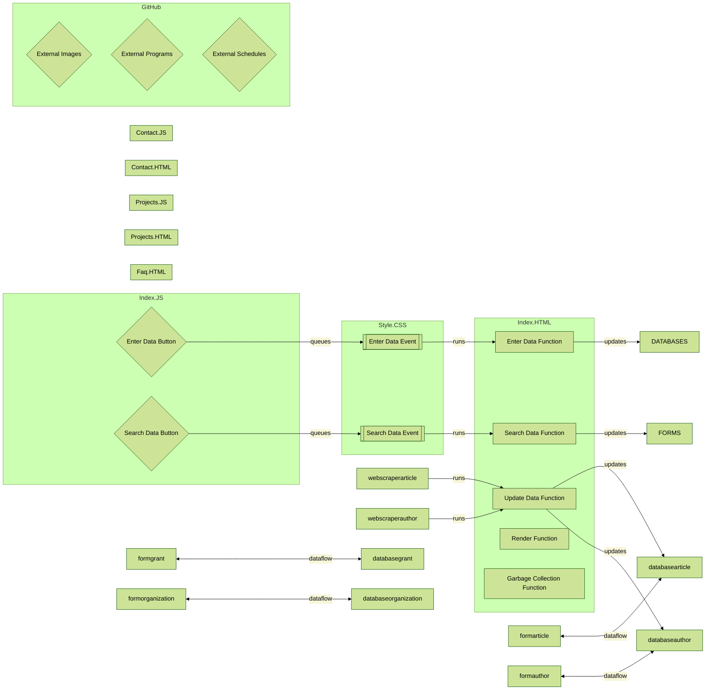

# Portfolio Webpage
## Setup
Various coding demonstration projects need an appropriate showcase which itself doubles as another project.
## Problem
This website requires certain minimal functionality regarding content organization, content storage, layout artistic themes, layout organization, layout scaling, image loading, form validation, project data presentation, and user accessibility. The system is more than the sum of its parts, and each part must integrate into the whole seamlessly.
## Goals
- Display software programming, organization and planning, and system design competency
- Make data presentation a subtle, pleasurable experience
- Create GUIs that are user friendly and intuitive
- Make system easy to use and hard to break
- Optimize time management
## Options
### Content Organization
- Include a single index HTML projects page with no additonal HTML or external hyperlinks required
- Include an index HTML homepage with external hyperlinks to projects, github, resume, faq, and contacts
- Include an index HTML homepage; additional HTML pages for projects, faq, and contacts; and external hyperlinks to github and resume [current]
### Content Storage
- Use website as static silo storage, and include all content within the website server folder
- Use website as dynamic presentation hub, and link to external content whenever possible [current]
### Layout Artistic Themes
- Do not use any artistic themes
- Use prefabricated static CSS
- Use prefabricated keyframe animated CSS
- Create original static CSS  [current]
- Create original keyframe animated CSS
### Layout Organization
- Do nothing and let HTML code autostack 
- Use CSS Flexbox
- Use CSS Grid [current]
### Layout Scaling
- Use single static layout regardless of screen size
- Use media queries with breakpoints for large screens and phones 
- Use media queries with breakpoints for large screens, tablets, and phones [current]
- Use media queries with breakpoints for hi res screens, large screens, tablets, and phones
### Image Loading
- Do nothing and let image icons sit onscreen until all the images intitially load
- List sources for the other more image heavy pages on initial image single image homepage using JS [current]
- Use a window onload global event handler to forestall page updating while the images load
- Play a skeleton loading animation while page images load
### Form Validation
- Have neither form validation nor error messages
- Use automatic HTML "required" client side validation and error messages
- Use custom JS client side validation and error messages [current]
- Use custom JS.node server side validation and error messages
- Use custom PHP server side validation and error messages
### Project Data Presentation
- Use separate HTML webpages for each project, but do not use any JS to jazz it up
- Use separate HTML webpages for each project, then use subtle JS touches to jazz it up
- Use separate HTML webpages for each project, then use flamboyant JS to overwhelm the viewer
- Use a single page application HTML to present all projects at once, but do not use any JS to jazz it up
- Use a single page application HTML to present all projects at once, then use subtle JS touches to jazz it up [current]
- Use a single page application HTML to present all projects at once, then use flamboyant JS to overwhelm the viewer
### User Accessibility
- Do not implement any user accessibility techniques
- Use high foreground/background contrast
- Use high foreground/background contrast and image alt tags [current]
- Use high foreground/background contrast, image alt tags, and keyboard shortcuts
- Use high foreground/background contrast, image alt tags, keyboard shortcuts, and dynamic settings selection options
## Solution
Demonstrate core competencies without too many bells and whistes to distract from the clean, minimal requirements of this website: present the site creator as an innovative software designer and manager by highlighting and glorifying his or her web application development accomplishments. All else is dross. Allow for multiple target users&mdash;programmers vs managers or the logical vs the artistic&mdash;to easily select and view what data they prefer&mdash;either code, design docs, or working prototypes&mdash;using an organized, intuitive layout. Keep peripherals such as resumes and githubpages behind external links. The github.io static hosting restrictions and lack of php or node.js experience will limit the backend applications of this website, so polish the frontend and warn users that they can't actually send emails, etc.
## System Architecture


## Development Schedule
```mermaid
%%{init: {'theme': 'forest', 'themeVariables': 
{ 'primaryColor': '#DDDA4D', 'edgeLabelBackground':'#F7F6DA', 'tertiaryColor': '#D5DEF6'}}}%%
gantt
    dateFormat  YYYY-MM-DD
    title       Project Webpage
    
    todayMarker stroke-width:5px,stroke:#0f0,opacity:0.5
    
    section Plan
    Define problem scope      	:done,  scope, 2022-02-05, 5d
    Define target user          :done,  user, after scope, 3d
    Draft resume		:done,  resumedraft, 2022-02-20, 1d
    Iterate resume		:done,  resumeiterate, after resumedraft, 10d
    Draft readme                :done,  readmedraft, after user, 6d
    Iterate readme              :done,  readmeiterate, 2022-03-31, 1d
    Draft designdoc             :done,  designdocdraft, after readmedraft, 5d
    Draft architecture          :done,  archituredraft, 2022-03-02, 1d
    Code architecture           :done,  architurecode, 2022-03-15, 3d
    Draft gantt chart           :done,  ganttdraft, 2022-03-20, 3d
    Code gantt chart            :done,  ganttcode, 2022-03-30, 1d
    
    section Prototype
    Collect research articles   :active, pdfcollect, 2021-10-01, 2022-01-05
    Create author database      :done, authordbcreate, 2021-11-05, 2021-12-30
    Create article database     :done, articledbcreate, 2021-11-05, 2021-12-30
    Create org database         :done, organizationdbcreate, 2021-11-05, 2021-12-30
    Create grant database       :active, grantdbcreate, 2022-03-01, 2022-03-14
    Create filter algorithm     :done, algofiltercreate, 2022-01-10, 3d
    Iterate filter algorithm    :done, algofilteriterate, algofiltercreate, 4d
    Create main program         :done, maincreate, 2022-03-10, 3d
    
    section Prune
    Softcode filter algorithm   :active, algofiltersoftcode, 2022-03-15, 3d
    
    section Playtest
    
    section Polish
    
    section Post
```
## Responsibilities
- keyed list (uml seq diagram)
## Features
### Critical Implemented
### Critical Unimplemented
### Wishlist Unimplemented
## References
- [Accessibility Guidelines, Games 01](https://www.youtube.com/watch?v=-IhQl1CBj9U)
- [Accessibility Guidelines, Games 02](https://www.youtube.com/watch?v=XzNjaugTrNc)
- [Accessibility Guidelines, Websites](https://developer.mozilla.org/en-US/docs/Learn/Accessibility/What_is_accessibility)
- [Skeleton Loading Animation](https://www.youtube.com/watch?v=ZVug65gW-fc&t=195s)
- [Template Literals](https://www.youtube.com/watch?v=DG4obitDvUA&t=2069s)
